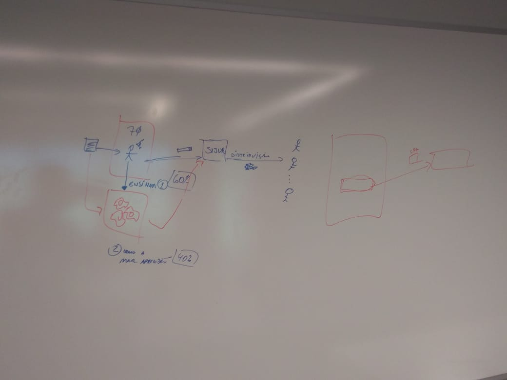
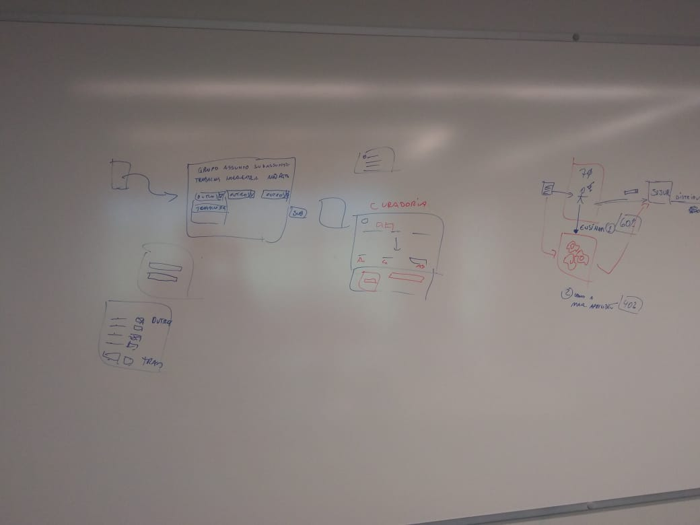
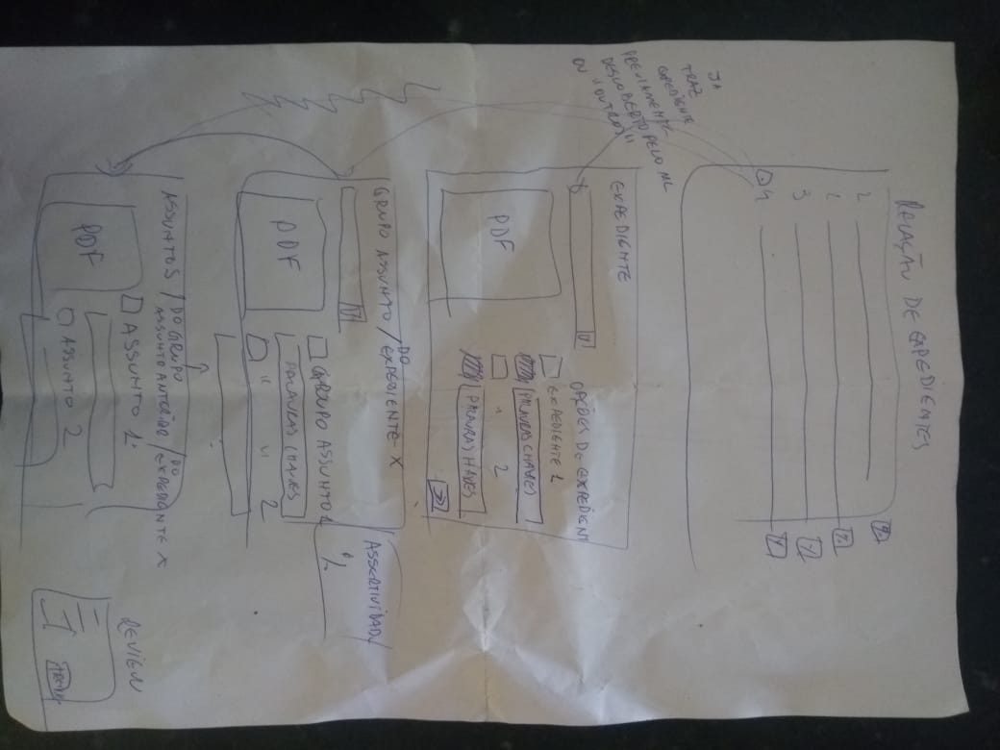
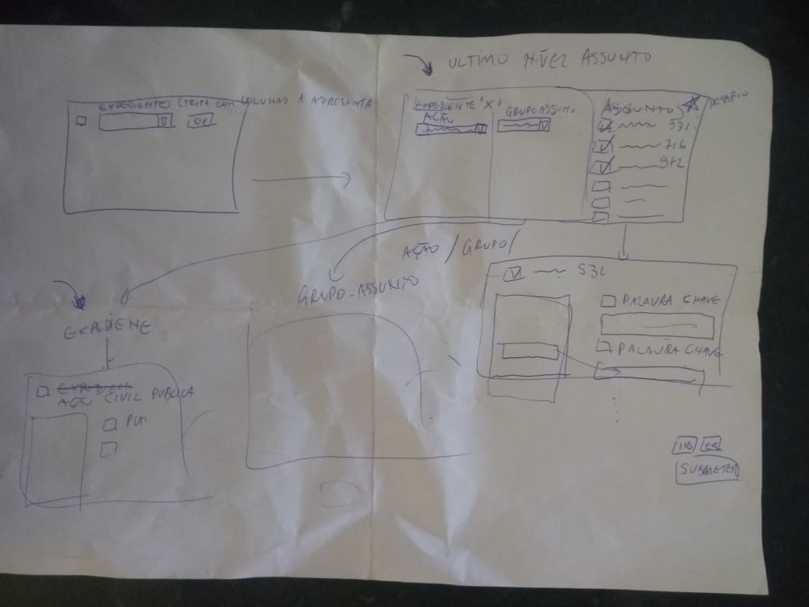

Meeting 01 Notes
===

Schedule and Duration
---

**Meeting Day/Time:** Seg, Sep 10, 2018 11:50  
**Meeting Duration:** 1 hour  

---

Attendees
---

### Microsoft
+ [x] [Kleumer Siqueira](mailto:kleumers@microsoft.com)

### One Way Solution
+ [x] [Matheu Willian](mailto:matheuswilliandf@gmail.com)

---

Agenda
---

### Project Overview

+ Kleumer explanied as-is and to-be.
+ Kleumer marked a two-steps solution.
  1. Application to teach and correct the machine learn module (60%).
  1. Machine learning module trained (40%).

### Prototype

+ Kleumer suggested a prototype.
+ Kleumer raised requeriments.
  + Ação, Grupo Ação and Assunto combo boxes.
  + Curadoria screen to change the combo boxes values and update database.
  + Keyphrases Screen to evaluate and insert manually.

### Detailed Prototype 

+ Kleumer increased the prototype with 6 screens:
  1. Relação de Expedientes:
     + Must show all Cod. Expediente.
     + Every line must show the accuracy of the classification.
     + Every Cod must be clickable.
     + Clik on a Cod must redirect to next screen.
  1. Expediente:
     + Appears when a Expediente was clicked on screen last.
     + Must show Expediente number.
     + Must show Expediente keyphrases for each Expediente.
     + Must show ML accuracy.
     + Should show PDF preview.
     + Must have a next buttom.
  1. Grupo Assunto:
     + Appears when Next buttom was clicked on last screen.
     + Must show Expediente number.
     + Must show Grupo Assunto number and name.
     + Must show Grupo Assunto keyphrases for each Grupo Assunto.
     + Must show ML accuracy.
     + Should show PDF preview.
     + Must have a next buttom.
  1. Assunto:
     + Appears when Next buttom was clicked on last screen.
     + Must show Expediente number.
     + Must show Grupo Assunto number
     + Must show Assunto number and name.
     + Must show Assunto keyphrases for each Assunto.
     + Must show ML accuracy.
     + Should show PDF preview.
     + Must have a next buttom.
  1. Review:
     + Appears when Next buttom was clicked on last screen.
     + Must show Expediente number.
     + Must show Ação combo box and allow changes.
     + Must show Grupo Assunto combo box and allow changes.
     + Must show all Assunto keyphrases and for each Assunto.
     + Must have check box for each Assunto and allow changes.
     + Must allow manually keyphrases insert for each Assunto and select between automatic or manual keyphrases.
     + Must have a buttom for re-train the model with the corrections.
     + Must show re-train results.
     + Should select keyphrases on a PDF preview.
     + Must have a home buttom.

### Inputs

+ Kleumer provides some reference material on cloud, [link](https://onedrive.live.com/?authkey=%21AJ3d3asFPOLPecQ&id=CAB750FEEB9A8504%21331664&cid=CAB750FEEB9A8504 "Source One Drive").

---

Takeaways
---

+ Matheus: Build a MVP plan.
